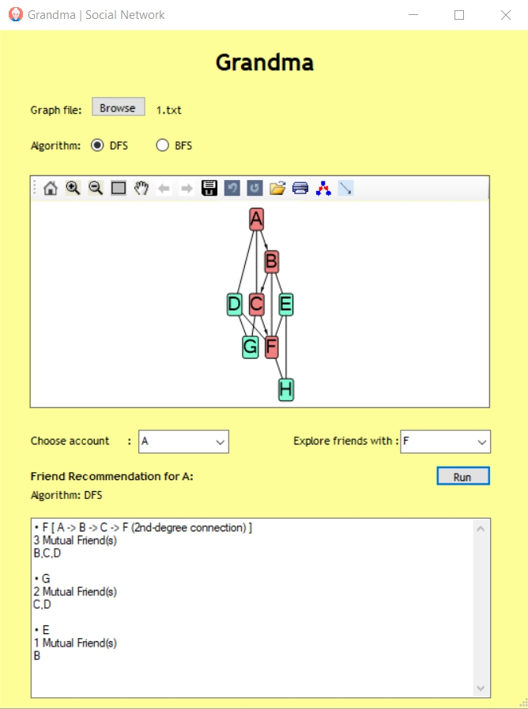

# Grandma Social Network
> A simple GUI-based social network with friend recommendation and exploration features

## Made by
| |
| ---  |
|Dionisius Darryl H.  |	
|James Chandra |	
|Jordan Daniel Joshua |



## General info
Grandma is a GUI-based social network with friend recommendation, exploration, and network visualization features developed using C# and .NET. This network is implemented with Graph and used algorithms such as Breadth-First Search (BFS) and Depth-First Search (DFS).

## Technologies and Requirements
* C# and .NET
* MSAGL Library
* Visual Studio (Compiling and Debugging)

## Features
* People You May Know (Friend Recommendation)
* Explore friends
* Social network interactive visualization

## How to Use
* To run the program simply navigate into ```./bin``` and run ```Grandma.exe```
* To compile the program, you can use Visual Studio 2019 by opening the ```Grandma.sln``` file in ```./src/Grandma/```

## Thank you
